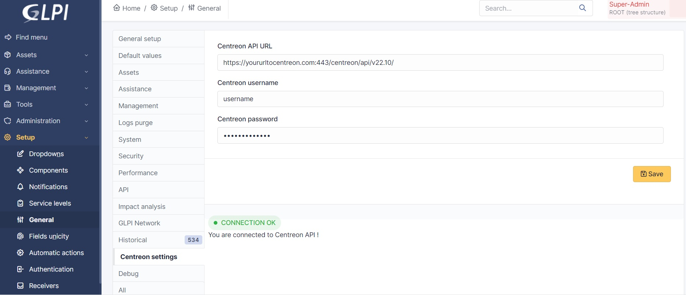
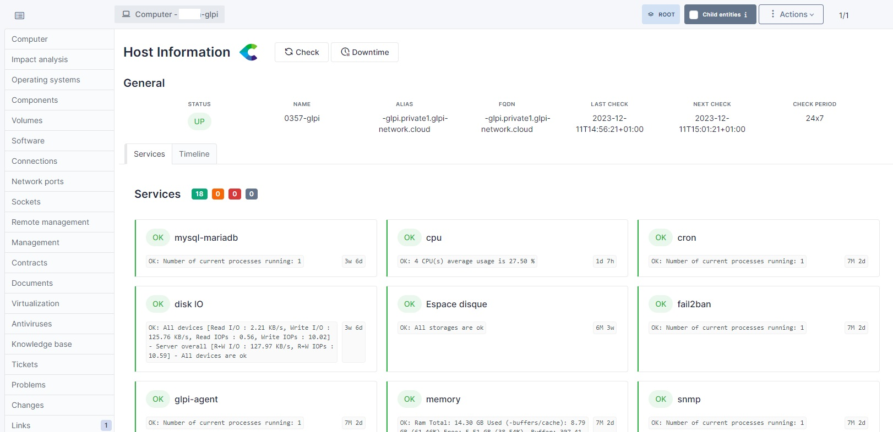
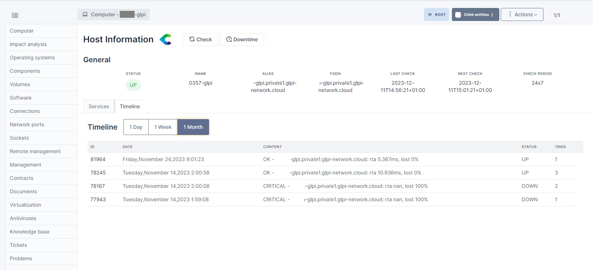

# Centreon GLPI plugin

This plugin allows you to see in your GLPI interface informations about the hosts that you are also monitoring in your Centreon app.

## Set your configuration

First, register your url to Centreon, username & password on the Centreon settings page :

As the connexion works successfully, a green badge appears on the bottom of the page.

## See host status in your computers list

You can now have a glimpse of your host status from the computers list :

## See all information about a host

For seeing more, click on the host and on the Centreon tab : you can access to all general information about the host and its services, without going on your Centreon app !

## Timeline and actions

Click on the timeline tab to see what happened on your host recently : yesterday, since one week, or since one month :

You can also perform 3 common actions :
    1. Send a check
    2. Set a downtime
    3. Do an acknoledgement

## Requirement

To allow the plugin linking GLPI items with Centreon items, **they must have the same name** in both applications.
## Contributing

* Open a ticket for each bug/feature so it can be discussed
* Follow [development guidelines](http://glpi-developer-documentation.readthedocs.io/en/latest/plugins/index.html)
* Refer to [GitFlow](http://git-flow.readthedocs.io/) process for branching
* Work on a new branch on your own fork
* Open a PR that will be reviewed by a developer
